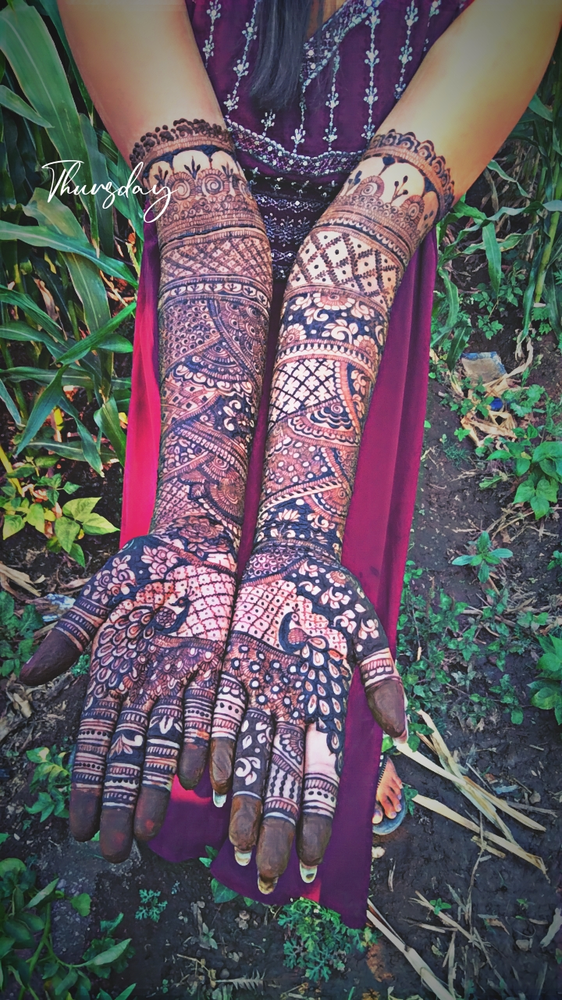

# 🌸 Arpita Mehndi Art Portfolio

Welcome to **Arpita's Mehndi Art Portfolio**, a beautifully crafted website to showcase traditional and modern mehndi designs. Designed with elegance and simplicity in mind.


---

## ✨ Features

- 💻 Simple and responsive layout
- 🎨 Image gallery with beautiful mehndi designs
- ⚡ Built with fast and modern tooling (Vite)
- 📱 Mobile-friendly
- 📷 Hosted artwork in `/photos/` folder

---

## 🚀 Live Demo

👉 [Click here to view the live site](https://your-demo-link.com)  
*(Replace with your actual GitHub Pages or hosting link)*

---

## 🔧 Tech Stack

- HTML5
- CSS3
- JavaScript
- [Vite](https://vitejs.dev/) – lightning-fast frontend tooling

---

## 📸 Gallery Preview

| Design 1 | Design 2 |
|---------|----------|
|  |  |
|  |  |

Explore more in the `photos/` folder!

---

## 🛠️ Installation

To run the project locally:

```bash
# Clone the repository
git clone https://github.com/your-username/arpita-mehndi-portfolio.git

# Navigate into the directory
cd arpita-mehndi-portfolio

# Install dependencies
npm install

# Start local dev server
npm run dev
